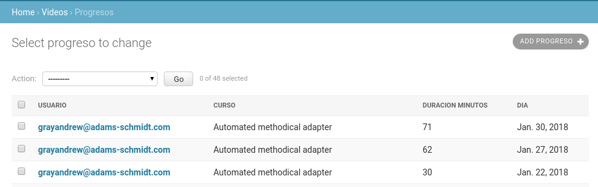
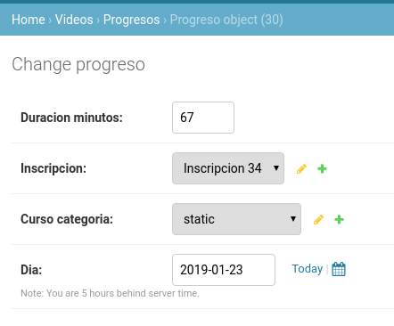
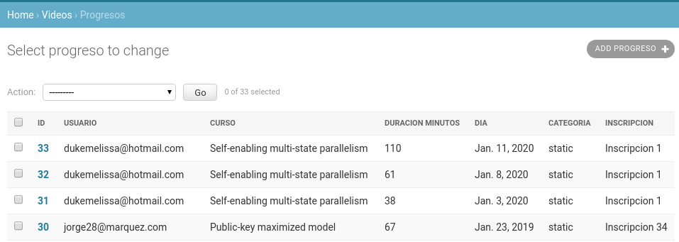

chn
===

# Modelos
Los modelos están distribuidos en tres apps: usuarios, videos y cursos.

*Se ha modificado el comportamiento por defecto de la clase User de Django para permitir hacer log-in solo con el e-mail, debido a que el documento no especifica username.* 

# Migración  
La migración asume que los datos son consistentes, y que cada par curso y usuario en la tabla del progreso del video tiene una coincidencia en la tabla de inscripciones.

## Código  

Los cambios respecto a la migración en sí se encuentra en la rama `migracion`.

Para ver el código directamente:
```
git show migracion
```
o más precisamente

```
git show migracion:chn/videos/migrations/0002_migracion_progreso.py
```

# Configurar entorno

```
$ python3 -m venv env/
$ source env/bin/activate
(env) $ pip install -r requirements.txt
```

# Probar solución
En caso que se quiera probar la solución con datos, hacer lo siguiente, estando en la rama **master**:

```
(env) $ git checkout master
(env) $ python3 manage.py migrate
```
Crear un superusuario `admin@chn.com`, para entrar al panel de administración:
```
(env) $ python3 manage.py createsuperuser
```

## Inyectar datos falsos
Para motivos de prueba, se ha creado comandos para inyectar datos falsos. Generar datos falsos de la siguiente manera:
```
(env) $ python3 manage.py poblar_usuarios --n-usuarios 30
(env) $ python3 manage.py poblar_cursos --n-categorias 20 --n-cursos 40 --n-inscripciones 40
(env) $ python3 manage.py poblar_videos --n-progreso 10
```

## Visualizar en el sitio de administracion
Si desea tener una clara visualización, se puede ver los datos en el sitio de administración de Django. Para ello, iniciar el servidor:
```
(env) $ python3 manage.py runserver 8000
```
Luego puede abrir el navegador web en la url [http://localhost:8000/admin/](http://localhost:8000/admin/), autenticarse.

Puede ver los datos relacionados a la tabla del progreso del video en [http://localhost:8000/admin/videos/progreso/](http://localhost:8000/admin/videos/progreso/)



## Probando rama `migracion`

Ahora, supongamos que hemos trabajado en una nueva rama para migrar Curso.Inscripcion y Curso.Categoria a Videos.Progreso:

**Hacer checkout a la rama `migracion`**
```
(env) $ git checkout migracion
```

Ejectuar cualquiera de estos dos comandos que hacen lo mismo:
```
(env) $ python3 manage.py migrate videos 0002
```
o
```
(env) $ python3 manage.py migrar_videos_progreso
Operations to perform:
  Target specific migration: 0002_migracion_progreso, from videos
Running migrations:

  Applying videos.0002_migracion_progreso... OK

```

## Revisar cambios en el sitio de administración
Si recargamos, nuestro navegador que estaba en [http://localhost:8000/admin/videos/progreso/](http://localhost:8000/admin/videos/progreso/) podemos ver los cambios relacionados. Se ve además la columna Inscripcion y Categoria agregados, que son campos propios de la base de datos.



